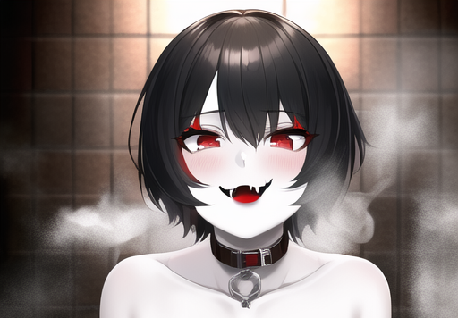

## Ghost Exhibition - Elevator Pitch

- [Ghost Exhibition - Elevator Pitch](#ghost-exhibition---elevator-pitch)
- [1000 foot view](#1000-foot-view)
- [Characters](#characters)
- [Story Synopsis](#story-synopsis)
- [Gameplay](#gameplay)
- [content](#content)
    - [Story](#story)
    - [Gallery](#gallery)

## 1000 foot view

Ghost Exhibition is a visual novel project based on the following basic ideas. 
* Anime
* Spooky Vibes
* Suspenseful Plot
* Sexy, Creepy girls ( Could they be ghosts? or possessed? )
* NSFW - Exhibition, Vanilla, Ghost, pale skin - tags.

## Characters

| Name | Personality | Style | Relationship to Main Character | Background |
|------|-------------|-------|--------------------------------|---|
|Naoko | Tomboyish | sporty, cool, casual| childhood friend | |
|Saoko | Older Sister| elegant, stern, fashion| childhood friend | |
|Hana | wild, Tsundere | fitness, shaman, casual  | childhood friend|Being trained as a shaman to take over the family business of demon hunting and exorcism |

## Story Synopsis

Our main character has recently been contacted by his old friend Hana. She is asking if he had heard from their old childhood friends Naoko and Saoko. Their parents had contacted her about something seeming off with them since their most recent ghost hunting trip (Hana is training to become a shaman and take over the family business of exorcism). And neither of them have been seen after that. Just as he tells her that he has not seen or heard from them at all for a few years, there is a knock at the door. Naoko and Saoko have arrived unannounced at his home. 

## Gameplay 

Gameplay will consist of mainly reading character diaologue and descriptions of their actions as the story unfolds. Certain narrative choices may be available to the player at certain times, such as making dialogue choices in a given scene. Narritave choices will effect the events and ending of a given playthrough of the game. You will not be able to see or unlock all CG and scenes in the game with a single playthrough. 

## content

#### Story
* Branching paths
* 3 endings 
* X amount of sex scenes

#### Gallery
* CG Viewer
* Scene replay
* Bonus Art - concept art etc.